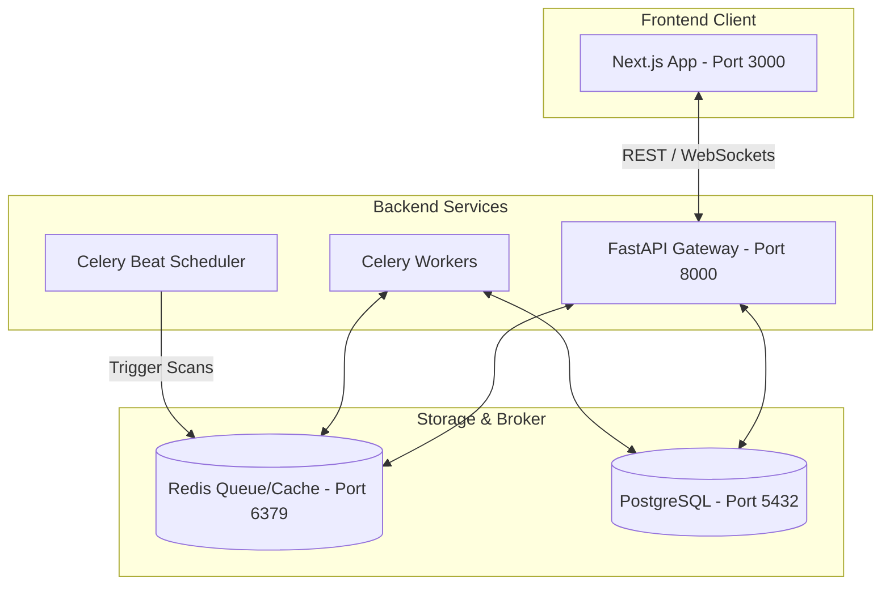

# AutoApply — Autonomous Job Application Agent

AutoApply is an end-to-end autonomous agent that discovers jobs 24/7, scores their relevance against your master profile, generates tailored ATS-friendly resumes (HTML & LaTeX) and custom cover letters, and organizes your application pipeline on a clean Kanban board.

---

## 🚀 Key Features

*   **24/7 Autonomous Scouting**: Scours greenfield job boards (Greenhouse, Lever, etc.) on an automated schedule.
*   **Conservative Scoring Engine**: Employs a strict multi-dimensional heuristics filter matching Skills, Experience Level, Projects, and Education against job postings to prevent score inflation.
*   **ATS-Friendly LaTeX Generation**: Instantly compiles customized resume LaTeX source code (`.tex`) tailored to match a job's keywords alongside visually interactive HTML reviews.
*   **Executive Chat Interface**: Command the system to trigger manual scans, fetch matches, and dynamically update job discovery preferences in natural language with zero configuration screens.
*   **Real-time Push Alerts**: Instant browser desktop notifications delivered via WebSockets when new high-match positions are indexed.
*   **Production-Ready Containerization**: Built-in production multi-stage Docker orchestration running all database, scheduling, worker, and frontend services in synchronization.

---

## 🛠 Tech Stack

| Layer | Technology |
| :--- | :--- |
| **Frontend** | Next.js 15, React, TypeScript, HSL Custom Glassmorphism Theme |
| **Backend API** | FastAPI, SQLAlchemy (Async), Uvicorn |
| **Database** | PostgreSQL |
| **Task Queue & Scheduler** | Celery, Redis, Celery Beat |
| **Task Monitoring** | Flower |
| **LLM Provider** | Google Gemini API (Free Tier) |
| **Containerization** | Docker, Docker Compose |

---

## 📊 System Architecture



---

## 🐳 Quick Start (Docker Compose)

The easiest way to run the entire application stack in production mode is using Docker Compose.

### 1. Prerequisites
*   [Docker Desktop](https://www.docker.com/products/docker-desktop/) installed and running.
*   [Google Gemini API Key](https://aistudio.google.com/apikey) (Free Tier is fully supported).

### 2. Configure Environment
Clone the template configuration file to `.env` and open it:
```bash
cp .env.example .env
```
Add your **Gemini API Key** and set a secure **Access Passcode**:
```ini
GEMINI_API_KEY=your_gemini_api_key_here
API_TOKEN=your_secure_passcode_here
```

### 3. Spin Up Services
Compile and run all containers:
```bash
docker-compose up --build
```
This builds and starts the following services:
*   **Next.js Frontend**: [http://localhost:3000](http://localhost:3000)
*   **FastAPI Backend API**: [http://localhost:8000](http://localhost:8000)
*   **Flower Task Monitor**: [http://localhost:5555](http://localhost:5555)
*   **PostgreSQL**: `localhost:5432`
*   **Redis**: `localhost:6379`

---

## 💻 Local Development Setup

If you prefer to run services bare-metal for debugging or extensions:

### 1. Backend Setup
Make sure PostgreSQL and Redis are running locally.
```bash
cd backend
python -m venv .venv
source .venv/bin/activate  # On Windows: .venv\Scripts\activate
pip install -r requirements.txt
uvicorn app.main:app --host 0.0.0.0 --port 8000 --reload
```

### 2. Frontend Setup
```bash
cd frontend
npm install
npm run dev
```
Open [http://localhost:3000](http://localhost:3000) in your browser.

---

## 📖 Step-by-Step Usage Guide

```
[Upload Master Resume] ➔ [Talk to Chatbot for preferences] ➔ [Trigger Discovery Scan]
                                                                      │
[Manual Application Copy] 🔐 [Kanban Board Drawer] 🔐 [Approve Scored Matches]
```

### 1. Seed Your Profile
Go to the **~/profile** page, upload your master resume in PDF format, and review the parsed sections (Skills, Work Experience, Projects, Education) extracted by the agent.

### 2. Configure Scraper Preferences
Navigate to the **Dashboard** and chat with the AI Assistant to update your target locations, job types, domains, and scrapers:
> *"Find software engineering internships in India and remote positions in the US."*
> *"Add Greenhouse scraper with company token: tesla."*

### 3. Discover & Score Jobs
Trigger a discovery scan from the dashboard. The agent will fetch raw job posts, check them against your profile, and assign a match score (0-100%). High-matching jobs will appear on the **~/jobs** page.

### 4. Review & Approve
Click on a job card to view the match breakdown analysis (matched skills, missing competencies, matching projects). If you like the job, tap **Approve**.

### 5. Access Tailored Materials
Go to the Kanban board (**~/applications**). Approved cards sit in the **Applied** column. Click a card to open the inspector drawer:
*   **View HTML Resume**: Inspect the tailored PDF/web format.
*   **View LaTeX**: Inspect, edit, and copy compiles-ready, ATS-friendly LaTeX code (`.tex`) with one click to paste directly into Overleaf or compile locally.
*   **Copy Letter**: Copy the custom cover letter optimized for the job description.

---

## 🔒 Security & Best Practices

1.  **Change Default Tokens**: In production, never use `supersecret` as your `API_TOKEN`. Set a strong token inside your `.env` file to encrypt access endpoints.
2.  **Environment Exclusion**: The repository's root `.gitignore` automatically blocks `.env`, local database uploads (`/uploads`, `/generated`), binary schedule registries (`celerybeat-schedule`), and system logs (`*.log`). Ensure these remain excluded.
3.  **Hiding Debug Helpers**: The frontend login passcode helper block automatically disables itself in production environments (`process.env.NODE_ENV === "production"`) to keep the user authentication portal clean and locked down.
